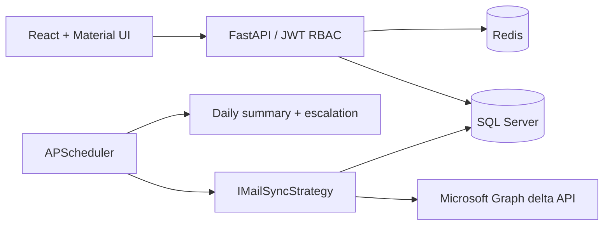

# OEIS system design

`OEIS_FULL_DETAIL_PROMPT.md` is the authoritative product specification. This document records the implemented architecture without changing that scope.

## Runtime architecture

One single-tenant deployment supports multiple user/shared mailboxes. Every API route requires an explicitly allowed role except health and authentication. Graph access uses one app-only credential, restricted outside the application by an Exchange Application Access Policy.

## Critical data flows

1. Scheduler starts one sync per active mailbox every five minutes.
2. Graph delta pages are followed to `@odata.deltaLink`; throttles honor `Retry-After`; a 401 forces one MSAL reacquisition.
3. Configurable classification rules run in priority order; unmatched mail becomes Customer.
4. Reply detection first uses Internet Message ID against In-Reply-To/References, then a 30-day bounded conversation-and-subject fallback.
5. Business time is calculated in the mailbox timezone using workdays and holidays. SLA tier is recomputed each cycle.
6. Unique `(email_id, threshold)` escalation records enforce exactly-once notifications.

## Security boundaries

- Azure credentials enter only through environment/secret-store injection and are never persisted per mailbox.
- Microsoft Graph `Mail.Read` application permission must be constrained by Exchange policy.
- JWT endpoint authorization is deny-by-default. Admin-only mutations return 403 to managers.
- Store UTC timestamps; localize only for business-calendar calculation and display.
- HTTPS terminates at Nginx/IIS or the platform load balancer.

## Tradeoffs

APScheduler is the v1 scheduler because jobs are bounded and the prompt permits it. Redis remains available for coordination/cache. The `IMailSyncStrategy` boundary permits later change-notification ingestion without altering classification, reply detection, SLA, or persistence.
